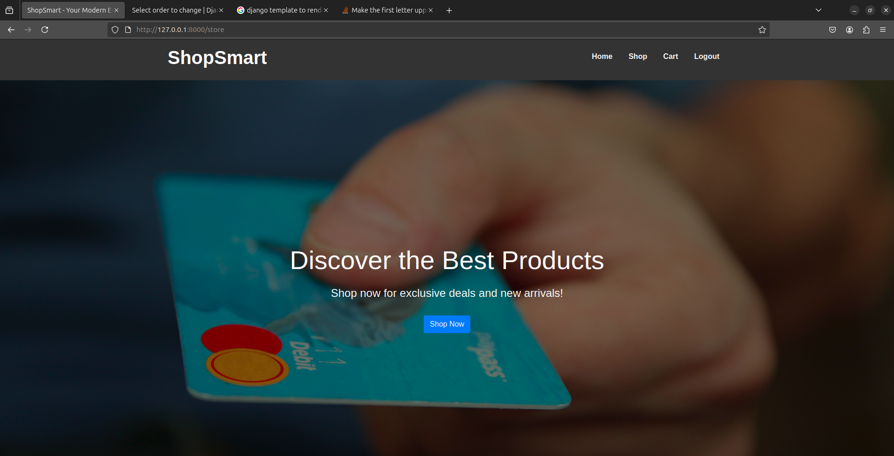
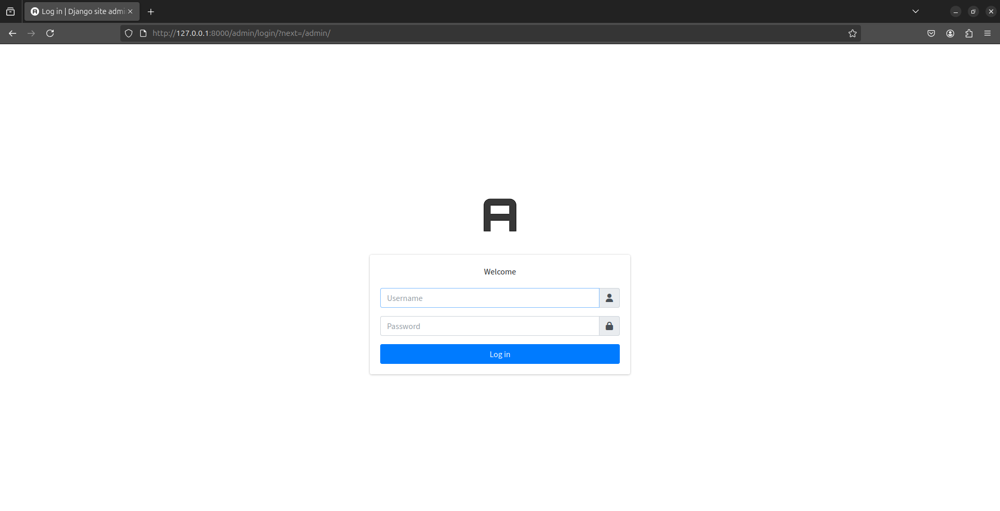

# E-Commerce Project

Welcome to the E-Commerce Project, a web application built with Django that allows users to shop for products, manage a cart, and view product details. This project aims to provide a seamless online shopping experience.

#### Home Page 


#### Admin Page 


## Features

- **User Authentication**: Users can log in and manage their accounts.
- **Product Catalog**: Browse and filter products by category.
- **Product Details Page**: View detailed information about each product.
- **Shopping Cart**: Add products to a cart for purchase.
- **Responsive Design**: The application is designed to work on various devices.

## Technologies Used

- **Django**: The main web framework used for building the application.
- **HTML/CSS**: For structuring and styling the web pages.
- **Bootstrap**: For responsive design and UI components.
- **SQLite**: The default database used for storing product and user information.


## Usages
You System must have the following things to use this File Sharing App.
 - Installation of `python` and  `pip`

    Python is available for every platform. Download it according to you os. You can download it from [Here.](https://www.python.org/downloads/)


Follow the mentioned procedure to run this project in your local system.
 - Clone or Download the Repository
```bash
    git clone https://github.com/santoshvandari/E-Commerce.git
    cd E-Commerce
```
 - Create the Virtual Environment Before installing the requirements. 
 ```Bash
    python3 -m virtualenv venv #For Linux User
 ```
  - Activate the Virtual Environment
  ```bash
    source venv/bin/activate  #For Linux
     Note: It is not Necessary to Create Virtual Environment but recommanded.
  ``` 
 - Install the Requirements
```bash
    pip install -r requirements.txt
```
 - Make the Migrations and Migrate the Model
 ```bash
    # For making the Migrations
    python3 manage.py makemigrations
    # For Migrating the Model 
    python3 manage.py migrate
```
 - Create Super User
```bash 
    python3 manage.py createsuperuser
    #Fill the Required Information
```
 - Run the Server
```bash
    python3 manage.py runserver #FOr Linux User
```
 - Open the url in Browser
 ```bash
    http://127.0.0.1:8000/  #For Home
    http://127.0.0.1:8000/admin # For Admin
 ```

## Contributing
We welcome contributions! If you'd like to contribute to this Ecommerce App , please check out our [Contribution Guidelines](Contribution.md).

## Code of Conduct
Please review our [Code of Conduct](CodeOfConduct.md) before participating in this app.

## License
This project is licensed under the [License](LICENSE).